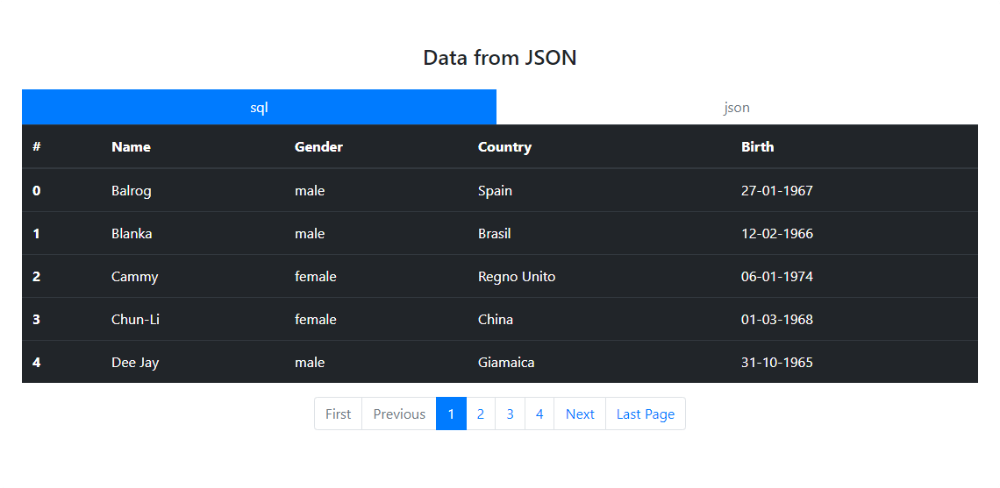
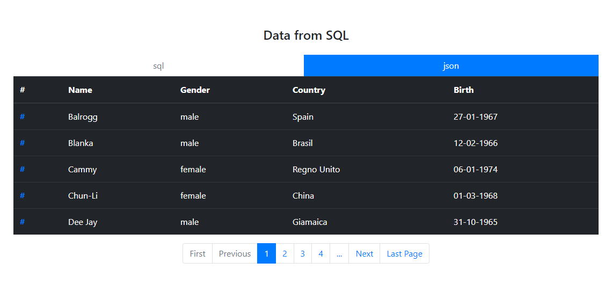
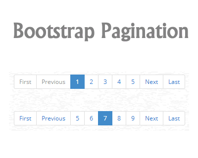

# Pagination
<dl>
You can choose if get data from SQL database o from a file JSON with a click on the 
buttons on top of table.
  

If you choose to get data from a database on a server(local or online) but it doesn't work, so automatically get data from a file json.
___
</dl>

## data from JSON

___
## data from SQL

___
## [Bootstrap 4 pagination](https://getbootstrap.com/docs/4.1/components/pagination/) 

